# Oracle Integration Cloud Workshop

This document shows how to use Oracle Integration Cloud (OIC) at the very basic level.


## Purpose

Before you get started, please note that this workshop is **meant for beginners**. Every step builds on all previous steps, so if you fully understand a step feel free to skip that step - please still read all of this document to make sure you did not miss any key configuration steps. Here is a more detailed list of what this workshop will cover:
- How to navigate to and from OIC, starting from the cloud login dashboard
- How to build a connection
- How to create and run a simple integration: REST endpoints
- How to track your integration instance
- Locations of various important pieces of information
	- e.g. Activity Log, Variable Tracking

Here is what you'll need for the workshop that is **NOT** covered in this workshop (i.e. prerequisites):
- Oracle Cloud tenancy
	- You can create a free trial account [starting here](https://www.oracle.com/cloud/free/). There will be a step in which you will need to provide your credit card information. This is for identity purposes, and your card will never be charged without your approval; other FAQs are answered [here](https://www.oracle.com/cloud/free/faq.html). If you do create a free trial account, you do not have to worry about anything money related mentioned in this workshop, and know that you have either 30 days or until your trial account money is used up to keep any non-free-tier items running on your trial account.
- Basic Auth User; for now, any user that is not Oracle SSO or is not federated will do.
- An application to integrate with (this is provided, but feel free to try to connect OIC to your own application after you complete this workshop)
- Basic Javascript and REST knowledge

By the end of this workshop, it is expected that you will be able to create your own integrations and know where to get help if you get stuck. Don't be afraid to search the internet for a specific error, the REST API catalog on OIC, or just general information on something you noticed while playing around with the OIC dashboard.


# Let's get started

## **STEP 1**: Navigating to OIC

In this step, you will navigate to and from OIC. You will need to travel along this path: (Oracle cloud)->(cloud dashboard)->(integration instance page)->(OIC home)->(integration dashboard).

### 1.1: Logging in to Oracle Cloud (OCI)
1. Open a web browser and navigate to [cloud.oracle.com](cloud.oracle.com).
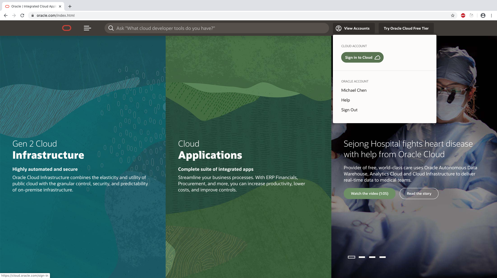
2. Enter the name of your account/tenancy.
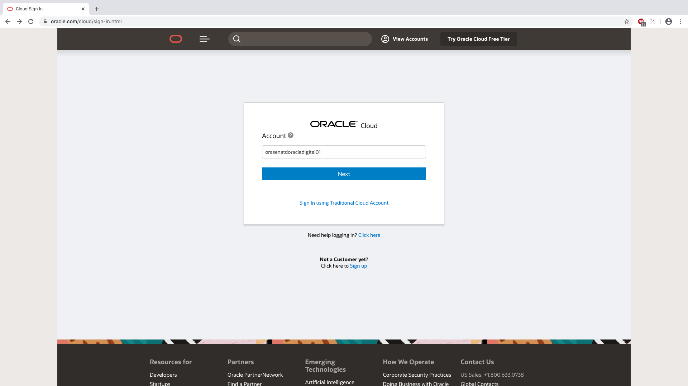
3. Enter your credentials for either basic authentication/user or using a federated account (i.e. Oracle SSO).
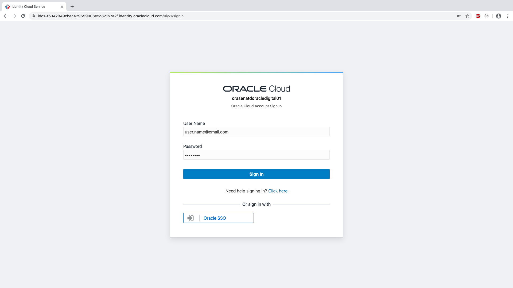

### 1.2: Navigating to the Integration Dashboard
1. Once you log in to your cloud tenancy, you will arrive at one of two pages: the PaaS dashboard or the IaaS dashboard.

	1. If the Integration link appears for you (first image) then you can click **Integration**. Otherwise you can navigate to the same page by selecting the hamburger menu on the top left corner (it looks like three horizontal lines stacked vertically, or a capital Greek Xi Ξ in some type faces) and selecting **Integration** (second image). Note: this might take you to an intermediate page in which you will have to click **Open Service Console** (third image).
	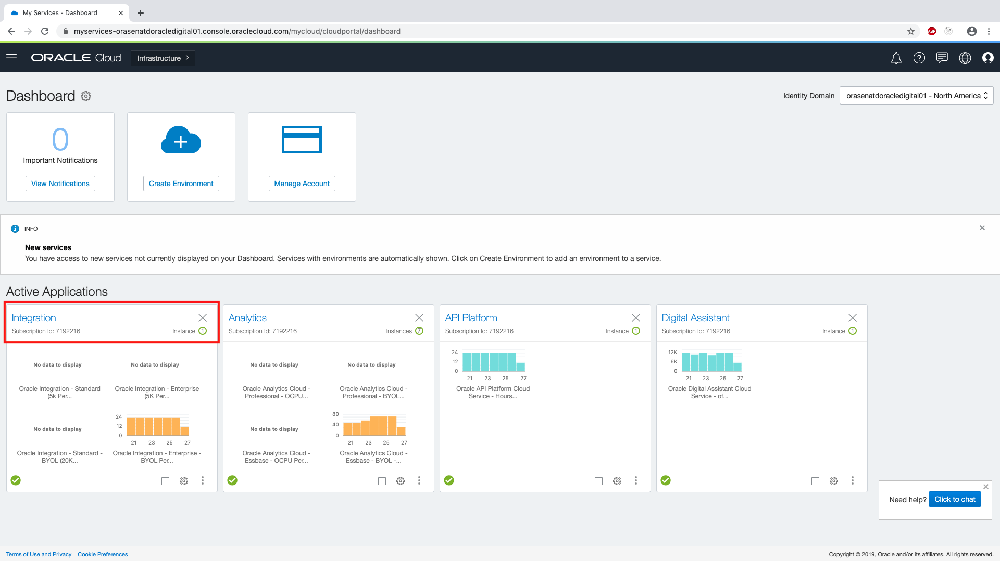
	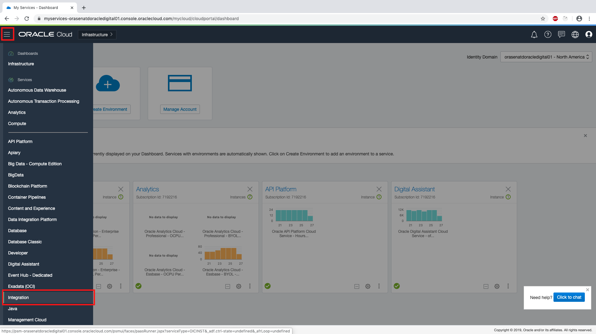
	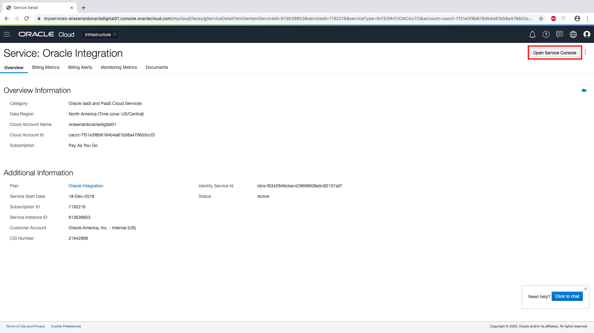
	
	2. Alternatively, you might find yourself at the IaaS dashboard (first image). In that case, select the hamburger menu on the top left corner, scroll down to **Platform Services**, and select **Integration** (second image). This may open a new tab or window.
	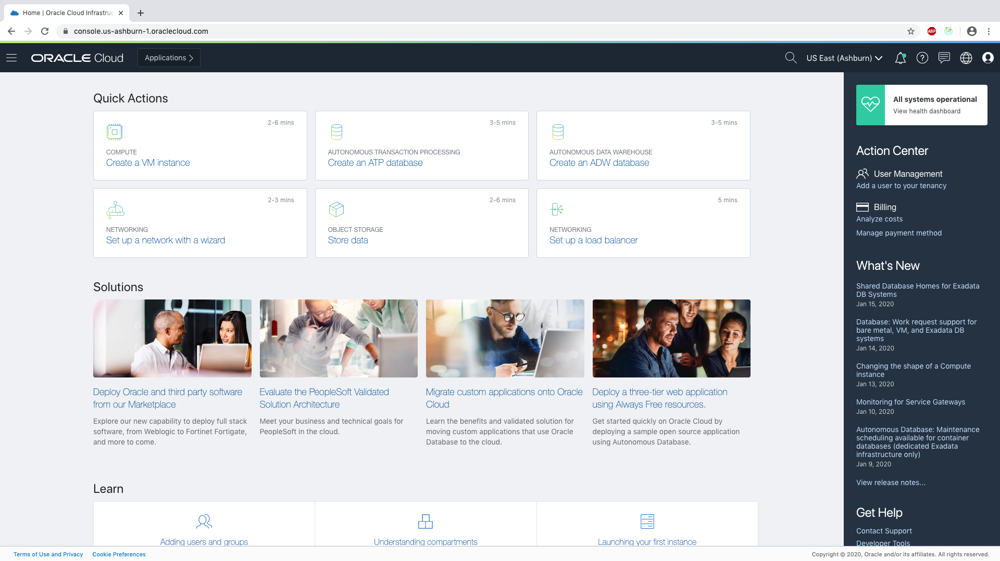
	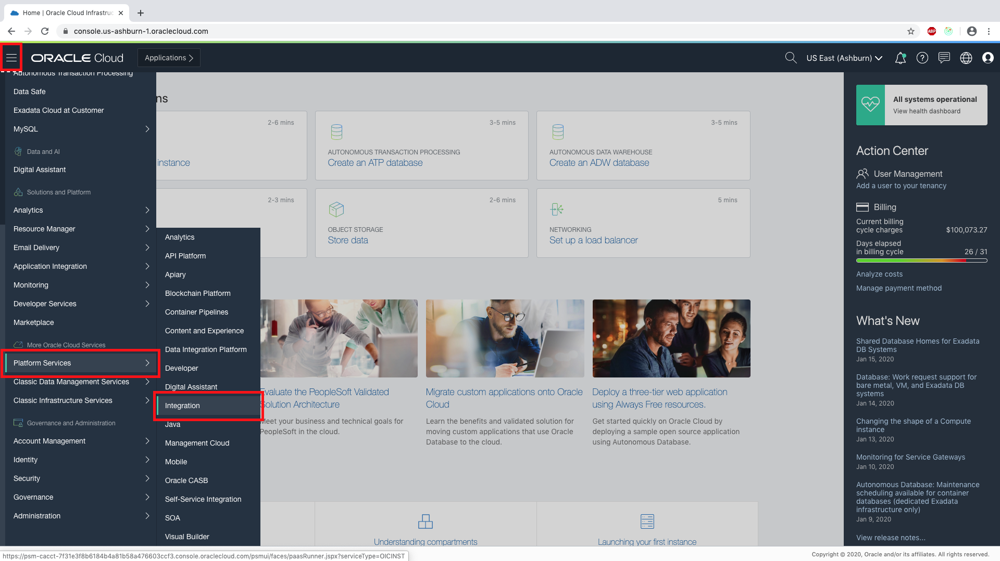

2. Finally you will arrive at the Integration Instance page. It looks like this:
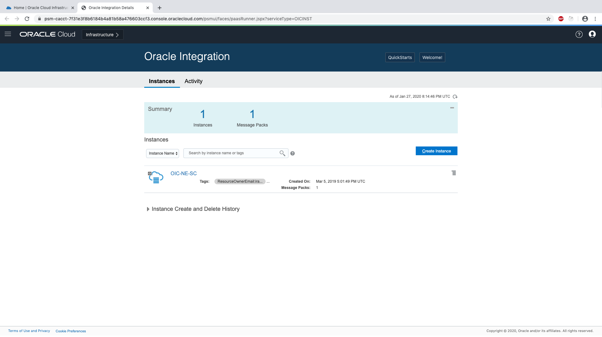

3. If you see an instance you are authorized to create test integrations on, skip this step. Otherwise you will need to provision an OIC instance. Click **Create Instance** and fill in the details however you want with these constraints:
	- Satisfy all items that have an asterisk \* next to them.
	- Select your home region.
	- Make sure you select the proper license type: check with your Oracle representative and/or confirm that you own an integration software license (remember: THIS COSTS MONEY).
	- Leave the Details page as its defaults, selecting an integer between 1 and 3 for "Number of 20K Messages Per Hour Packs". You may opt to choose "Integration and Process" if you have purchased the Enterprise edition and if you plan on creating process automation some time in the future (e.g. with process applications and decision models), but this is potentially more expensive.

Here's an example:
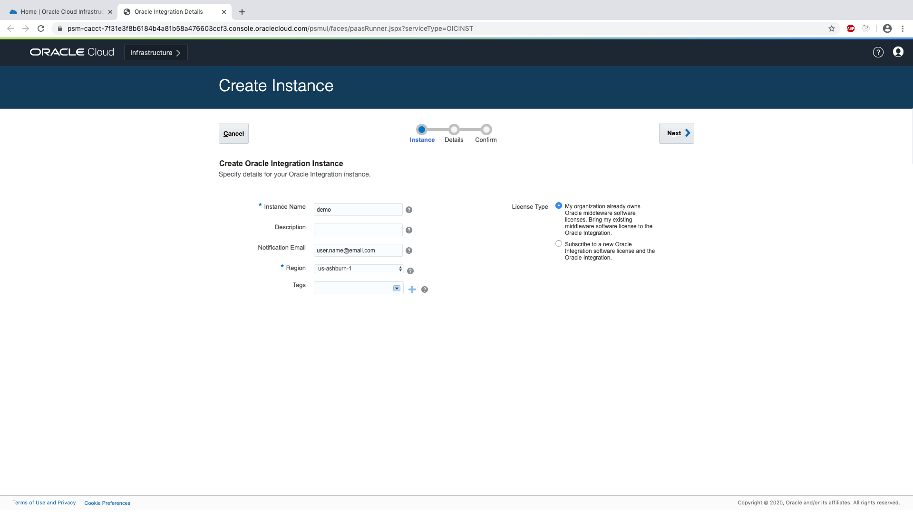
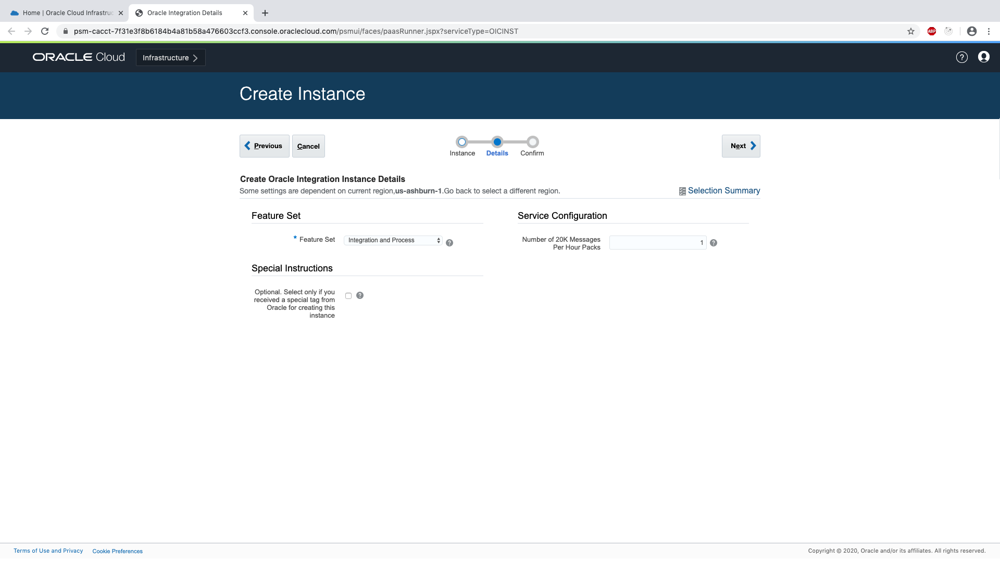
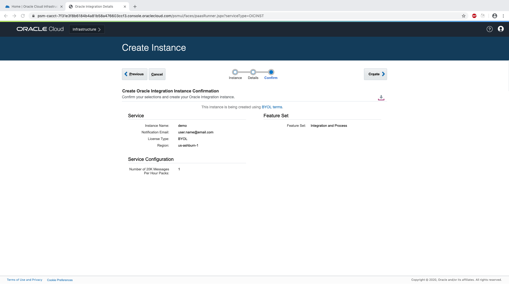
**NOTE**: this instance was not actually created. For the remainder of this workshop, all future graphics refer to the "OIC-NE-SC" instance.

4. Once your instance is provisioned, you will see that the instance is ready to use. To navigate to OIC home, click the small hamburger menu indicated by the red arrow in the below image, then click **Open Oracle Integration Home Page**. You should see a similar screen as shown in the second image
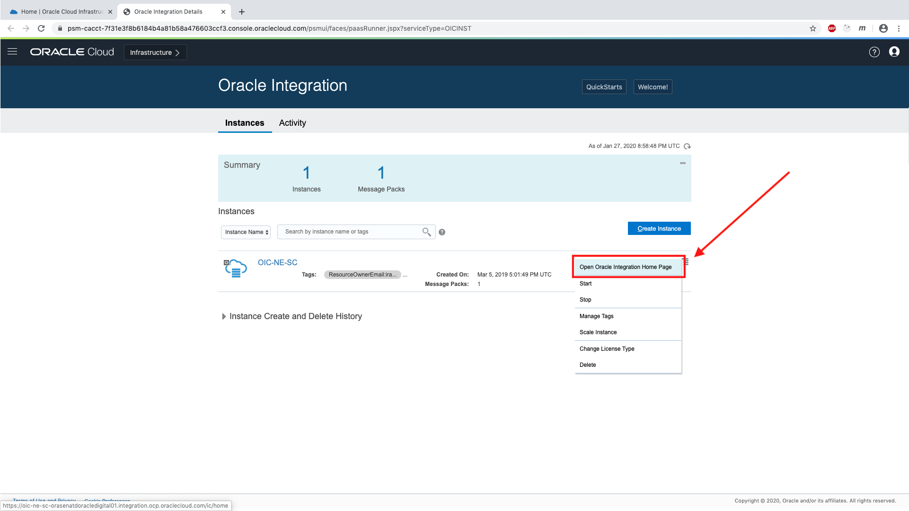
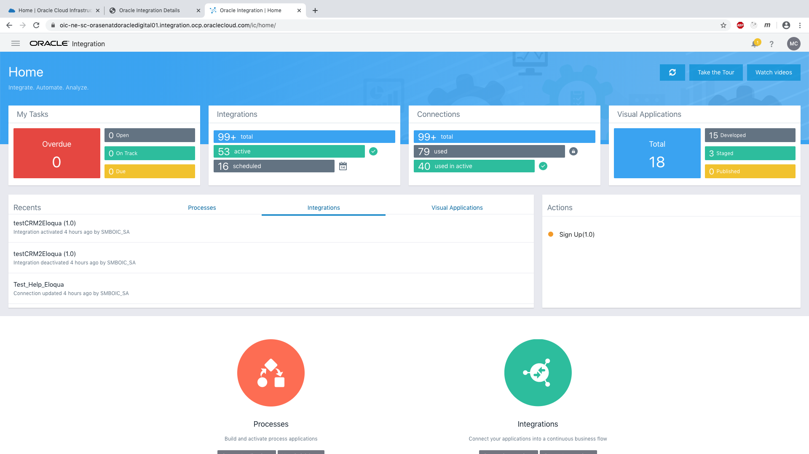

5. Finally, click the hamburger menu in the upper left corner and select **Integrations**. This brings you to the Integration Dashboard. You may see only the sample integrations that are always included in every Integration instance.
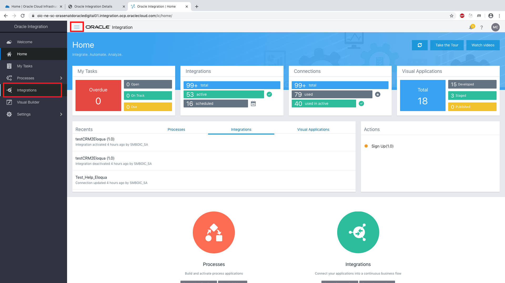
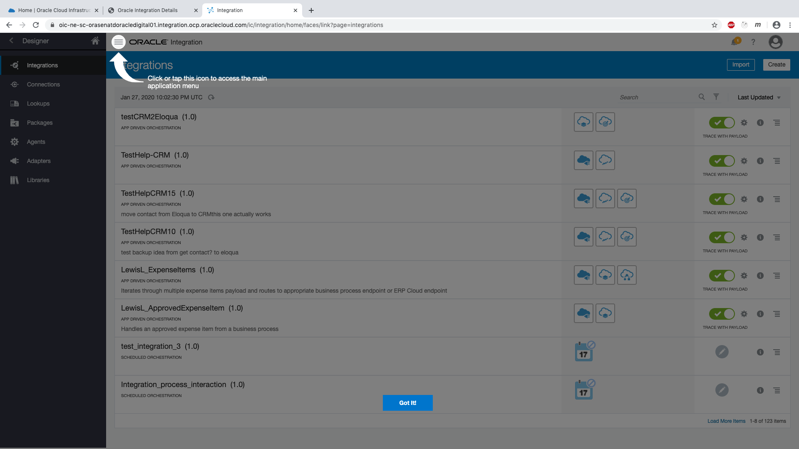

**Note**: you should automatically be brought to the "Designer" menu. You can confirm this by selecting the upper left hamburger menu to bring up a grey left sidebar with seven items: Integrations, Connections, Lookups, Packages, Agents, Adapters, and Libraries. Please view the [Miscellaneous important information within OIC](#misc) section below for more information.


## **STEP 2**: Connections

A **connection** is a way for OIC to connect to some application, including third-party applications, applications running on Oracle software, or even other integrations on OIC. A connection is based off of an **Adapter**. By default, you should see under the list of Connections (upper-left hamburger menu -> Connections) that there are already some sample connections built, including but not limited to the **Sample REST Endpoint Interface**. You will use the **Sample REST Endpoint Interface** and you will also create your own connection. First, however, you will need to define what exactly OIC is connecting to.

At [https://oic101.herokuapp.com/](https://oic101.herokuapp.com/), you will see a very simple application that has exposed two REST endpoints: `/callOic` and `/responseFromOIC`. You can see this in the code below:
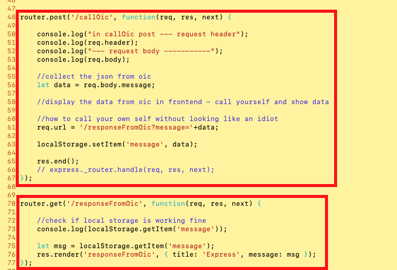
- The `callOic` endpoint is a POST call: this means that this application is configured to receive a payload from somewhere. In this case, that somewhere is OIC. For now, the only piece of information you need is that the endpoint to call is `https://oic101.herokuapp.com/callOic`.
- The `responseFromOIC` endpoint is a GET call: this means that this application will return some information when you enter the address `https://oic101.herokuapp.com/callOic` in a web browser (since web browsers by default make a GET request to any website you enter). OIC does not call this endpoint; instead, you can view the information stored in the application when you invoke `https://oic101.herokuapp.com/responseFromOIC` in a web browser.
	- Notice how the default message for the `responseFromOIC` endpoint is simply `Hello world!!!`. You will change this message to demonstrate that a successful connection between OIC and this application was made.

### Creating a connection
Remember to ***FREQUENTLY SAVE YOUR CONNECTIONS***. There will only be an initial and final reminder to save in this workshop; OIC does not have an "autosave" feature for connections or integrations.
1. If you haven't already, click the upper left hamburger menu and select **Connections**.
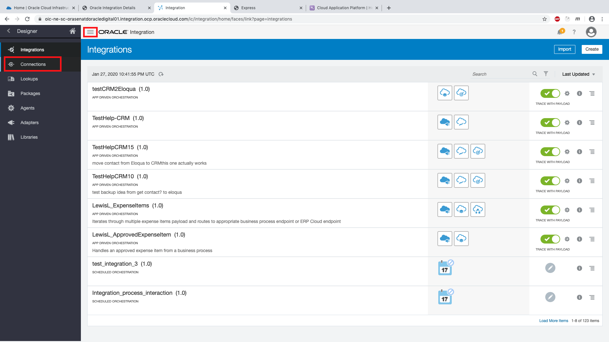
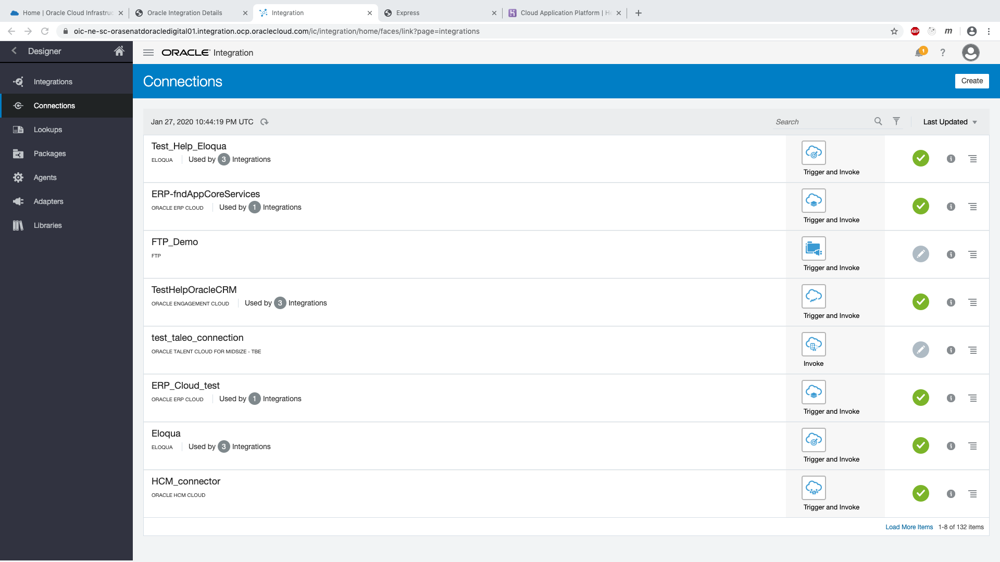

2. Click **Create** in the upper right corner, then scroll down or search for REST. Select REST to proceed to the configuration page.
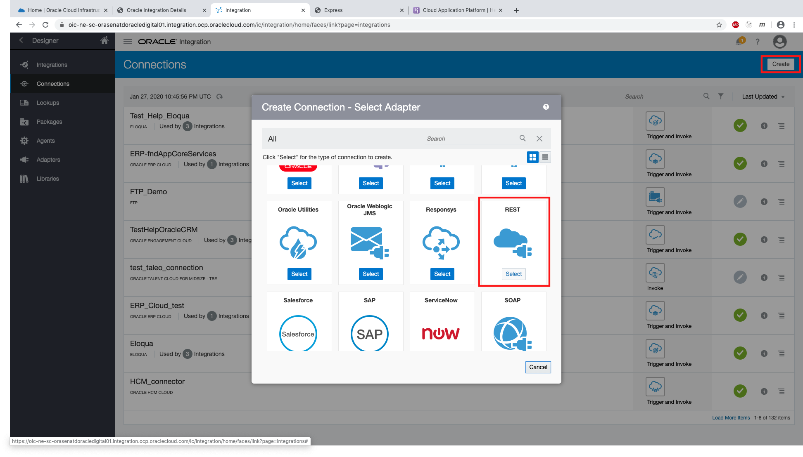

3. Enter a descriptive name for the connection. For the purpose of the workshop you can enter "OIC101-connection". Make sure the Role is set to **Trigger and Invoke**.
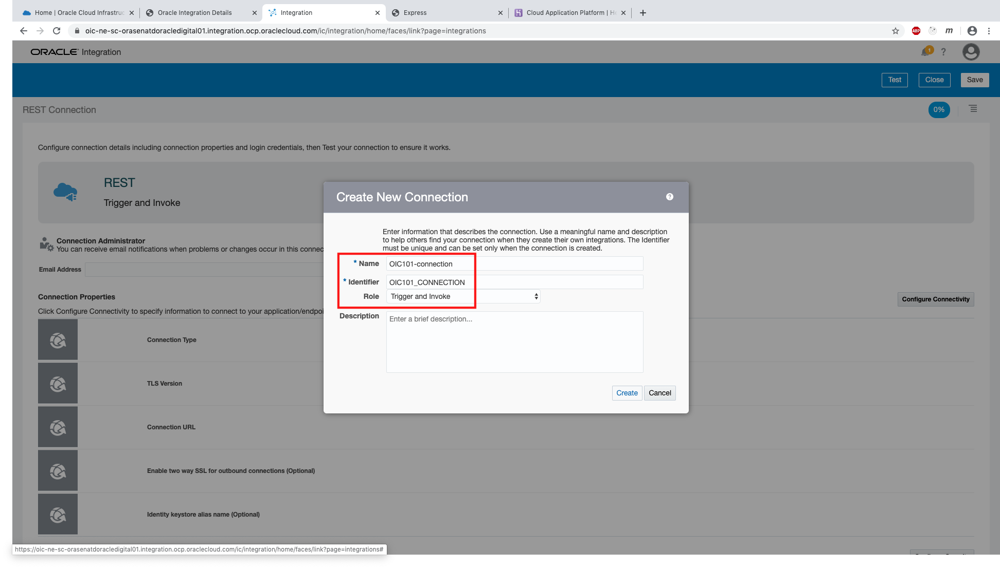

**NOTE**: Trigger means that if this connection is added to an integration, the application configured in this connection will _trigger_ the integration to begin. Invoke means that if this connection is added to an integration, that integration will be able to _invoke_ the application configured in this connection while OIC is running through the process flow of the integration. In some cases it makes more sense to only trigger or only invoke - in this case it makes the most sense to only invoke - but for the most part it is safe to create connections that can serve both incoming and outgoing requests.

4. Click **Configure Connectivity**. A dialog box will pop up with two required properties to be set. Set **Connection Type** to be "REST API Base URL" and set **Connection URL** to the **base URL** of the heroku application, `https://oic101.herokuapp.com`.
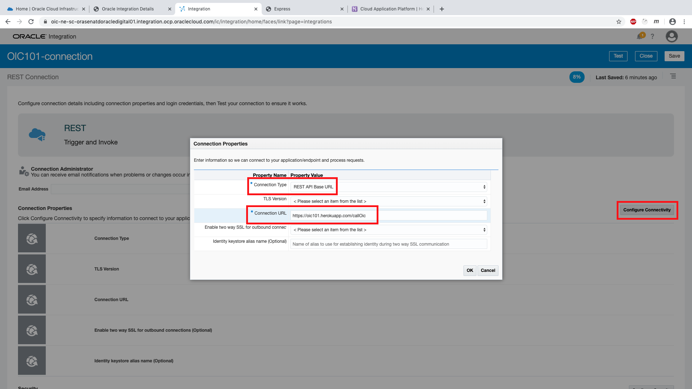

5. Scroll down to **Configure Security**. The application is pretty basic and does not require authentication; select "No Security Policy" for **Security Policy**.
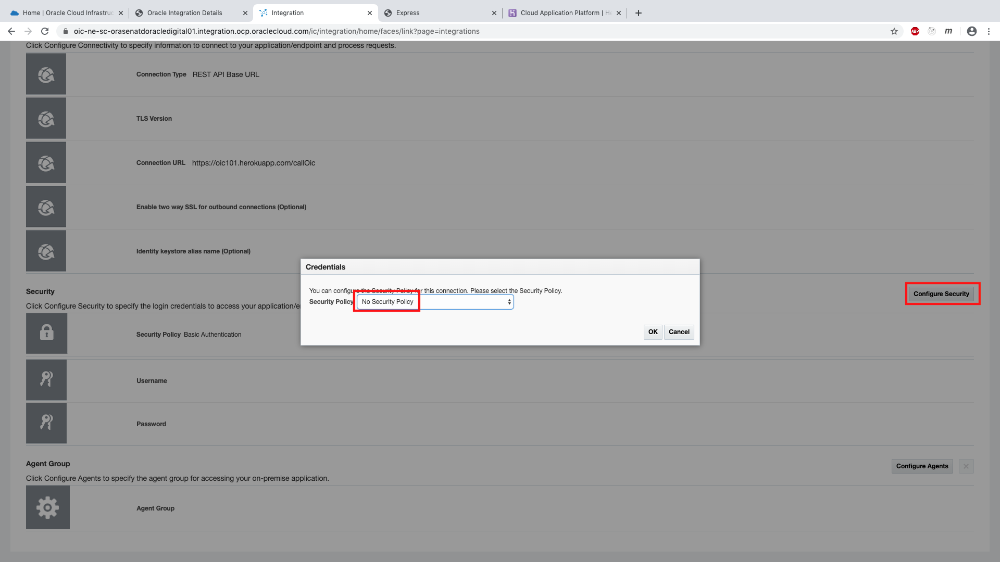

6. You do not need to configure an Agent for this connection. Scroll to the top and click **Test**. Once you see the green bar appear, or that the REST Connection becomes 100% configured (second image), click **Save** and then **Close**.
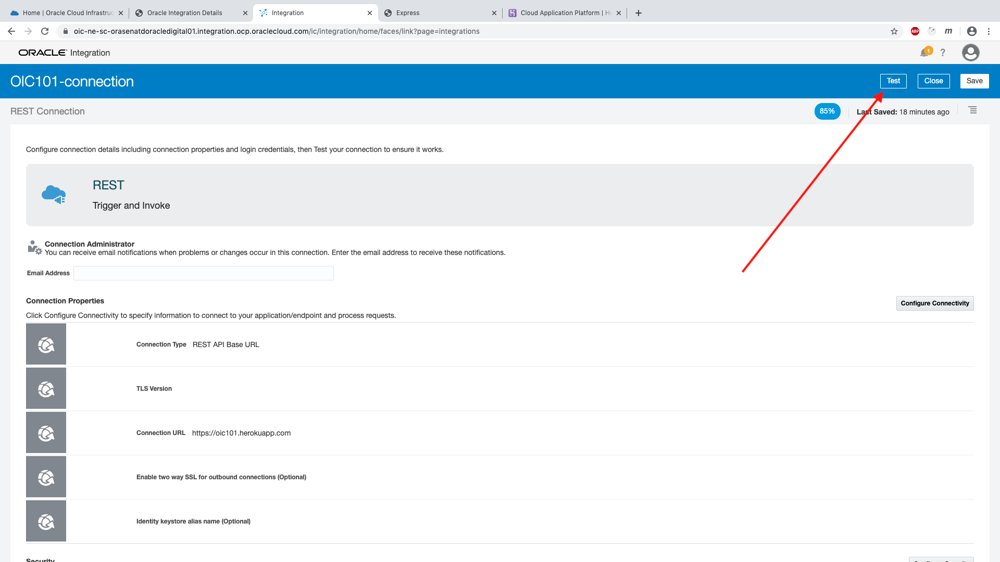
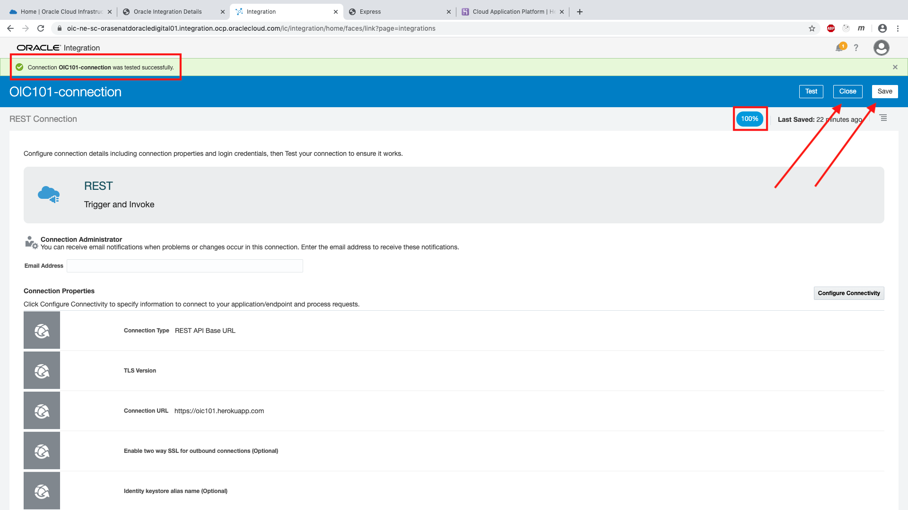

7. The connection should be ready to use, indicated by the green check mark on the right side of the window.
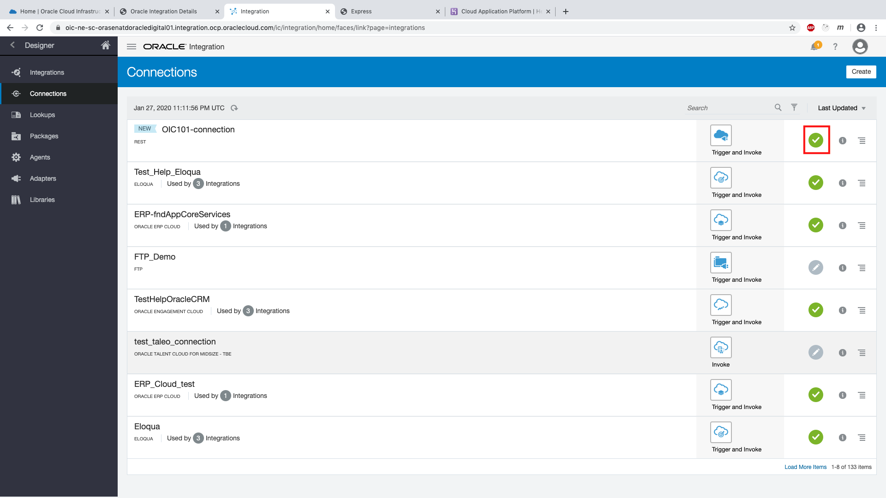


## **STEP 3**: Integrations

An **Integration** describes a process flow that performs a group of functions. Integrations can be triggered either by an application or by a schedule, called **Application-Driven Orchestrations** and **Scheduled Orchestrations** respectively. Integrations that are app-driven always use a defined connection that is configured as a trigger. Let's say that the connection is a Salesforce connection. Then in the integration, you would define the trigger to look for some kind of signal or API call, for instance when a contact is created in Salesforce. After some configuration on the Salesforce end, the integration will trigger whenever a contact is created in Salesforce. On the other hand, integrations that are scheduled rely on some schedule that will trigger the integration based on a frequency, for instance every day or every hour. This is more often used on a "gather-bulk-data" basis than a "one-action-one-trigger" basis, for instance moving all the logs between five minutes ago and last week to a backup server.

### Creating an integration
Remember to ***FREQUENTLY SAVE YOUR INTEGRATIONS***. There will only be an initial and final reminder to save in this workshop; OIC does not have an "autosave" feature for connections or integrations.
1. Navigate to the integration dashboard. It should look like the last image of section 1. If you are on the Connections page, click on the upper left hamburger menu and select **Integrations**.

2. Click **Create** in the upper right corner. This brings up a dialog box with six types of integrations you can build. Select **App Driven Orchestration**.
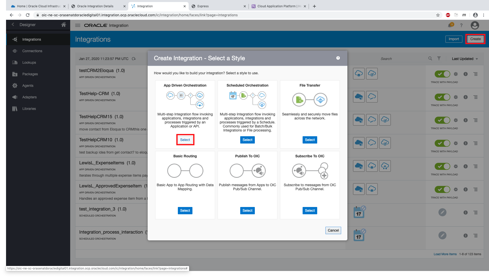

3. Enter a descriptive name for the integration. For the purpose of the workshop you can enter "OIC101-integration".
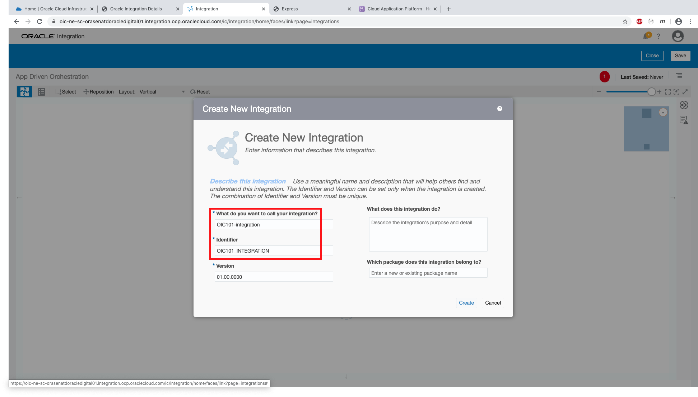

4. Now the trigger must be configured.

	1. For the trigger, select **Sample REST Endpoint Interface**, the same one mentioned earlier in **STEP 2**. There are two ways to do this: click the + in the empty trigger slot under "START" and find **Sample REST Endpoint Interface** (first image); or open the trigger menu on the right side, find **Sample REST Endpoint Interface** under the list of REST endpoints, and drag/drop the endpoint onto the empty trigger slot (second image).
	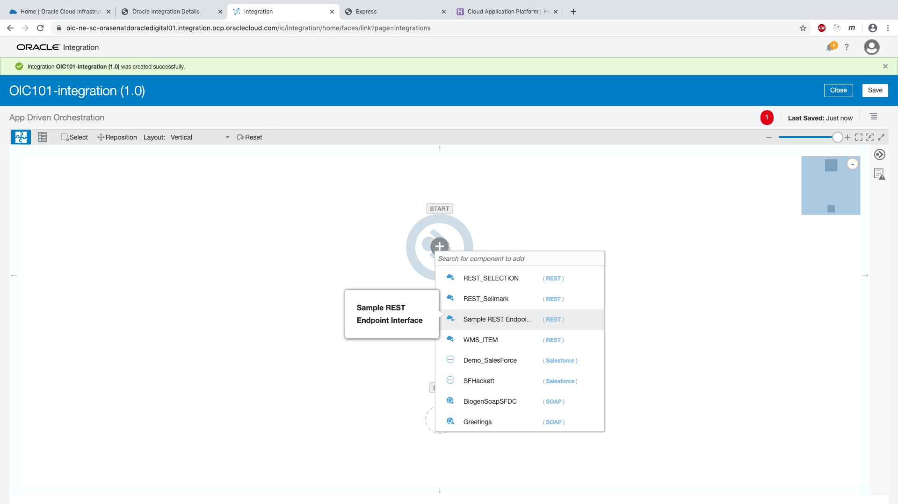
	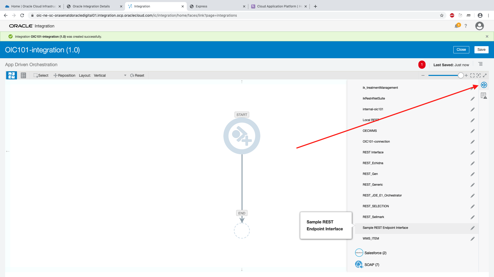

	2. A dialog box will appear. You will now enter the following information to finish configuring the initial REST trigger: **call the endpoint** whatever you wish (for instance, "start"), set the **relative resource URI** to "/", and leave the **action to be performed** as "GET". Click **Next** and then **Done** (no more configuration is required).
	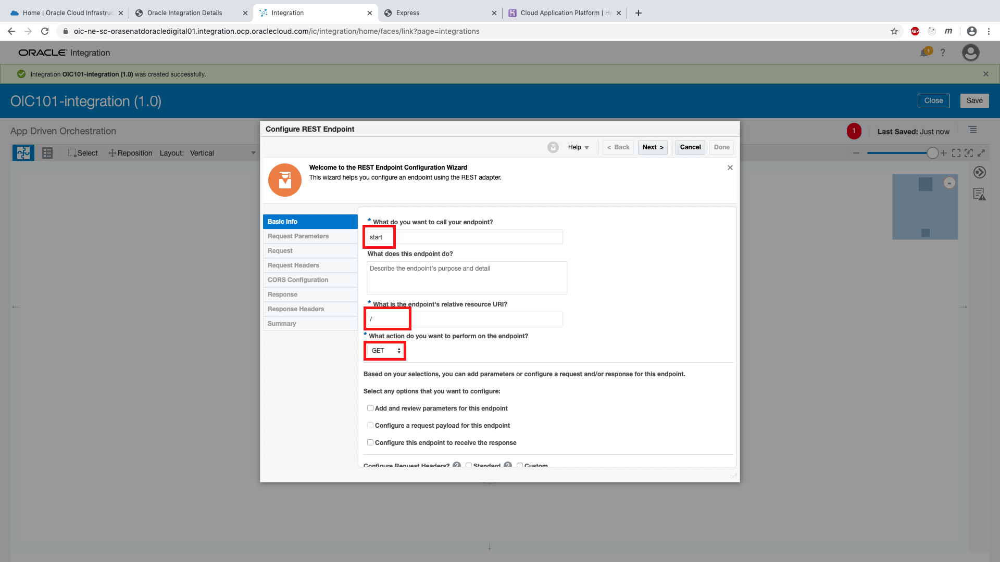

	3. After configuring, you should see a screen similar to this one.
	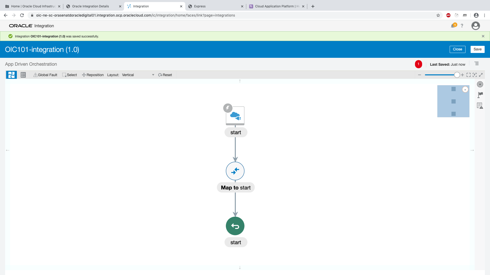
**What's going on here?** The connection added to the integration is one that uses the URL of the integration as the trigger. This means that whenever an application makes a GET request to the URL of the integration, the integration will fire. Since the relative resource URI was set to "/", no additional endpoint is being hit. For instance if the base URL of the integration were something like `https://integration.oracle.com` then any application that makes a GET request to that URL or technically `https://integration.oracle.com/` will trigger the integration. However, since searching a URL on a web browser will make a GET request to that URL, you will use this to manually trigger the integration.

5. Now the connection to the application will be configured.

	1. You will add `OIC101-connection` between the trigger and its associated Map. There are two ways to do this. You can either hover your cursor over the grey arrow from the trigger to the Map, click the +, and find **OIC101-connection** (first image); or open the invoke menu on the right side, find **OIC101-connection** under the list of REST endpoints, and drag/drop the endpoint onto the + between the trigger and its associated Map. Then click **Next**.
	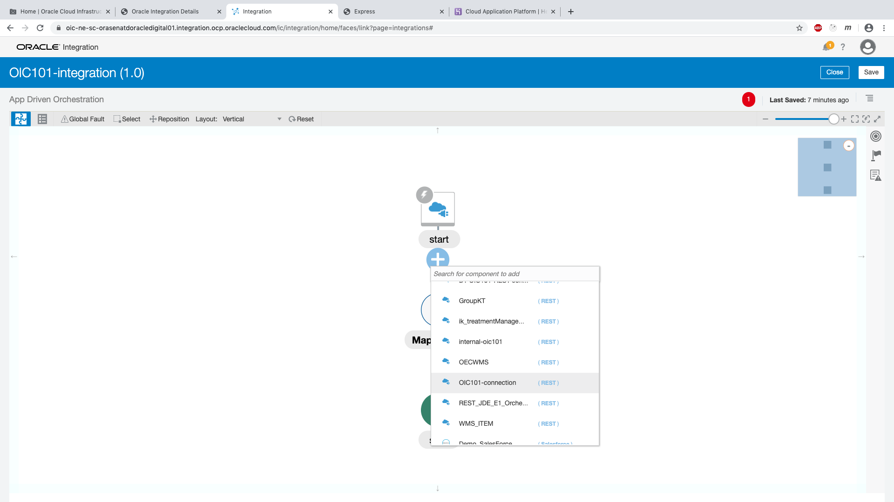
	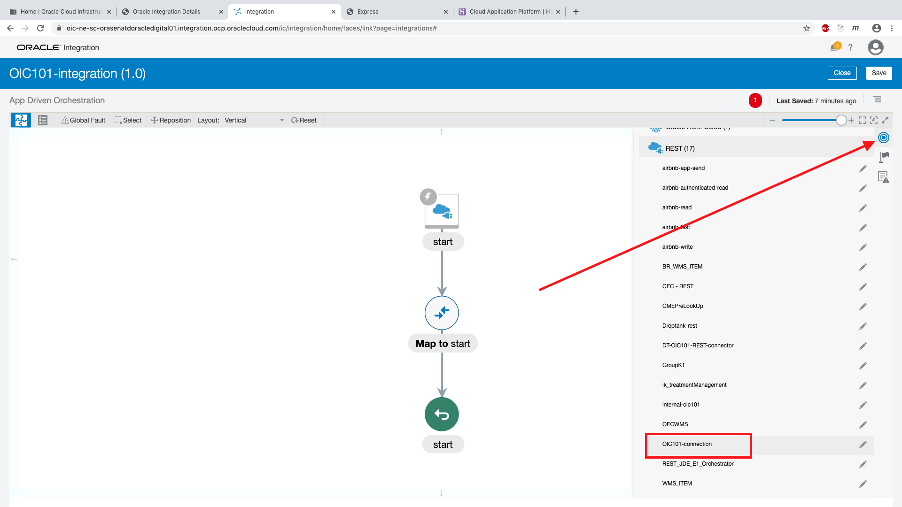

	2. A dialog box will appear. Enter the following information:
	
	| Field name                | Value                              |
	|---------------------------|------------------------------------|
	| Endpoint name             | sendToApp                          |
	| Description (optional)    | Sends a payload to the Express App |
	| Relative Resource URI     | /callOic                           |
	| Action to perform         | POST                               |
	| Configure request payload | (check this box)                   |

	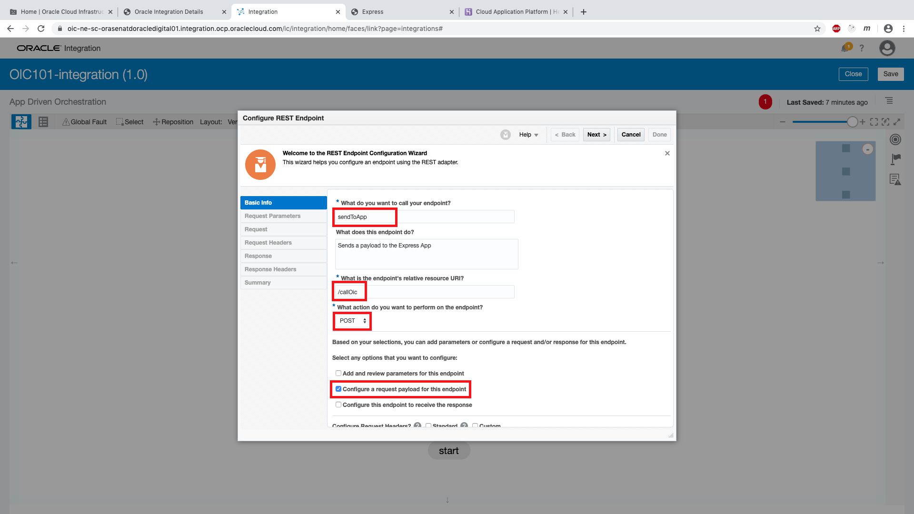

	3. Since this connection is a POST request, and since **Configure a request payload for this endpoint** is checked, you will have to define the format that the application will recognize. In this case, the format that is recognized is a JSON payload consisting of a single `message` (String) object. Here is a valid body that would be sent over to the application:
	```
	"body": {
		"message": "some string value"
	}
	```
	To configure this, first select "JSON Sample" for the **request payload format**. You will see an option to **enter sample JSON**; click `<<< inline >>>` (first image). Once inside, paste this minified version of the body above and click **Ok**: `{"message":""}` (second image). Then click **Next** and **Done**.
	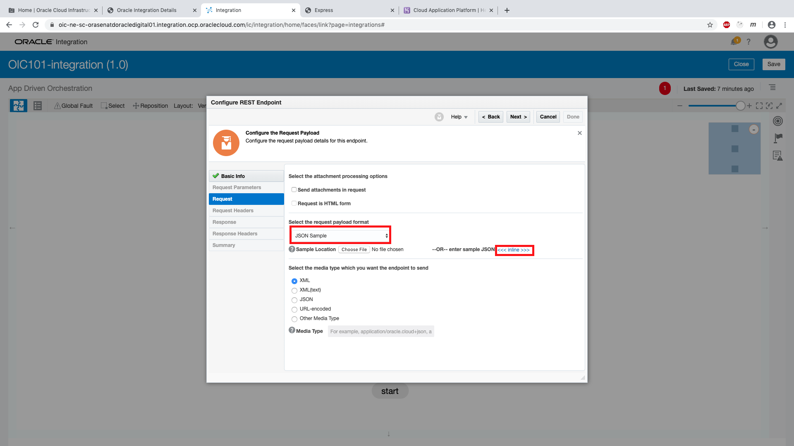
	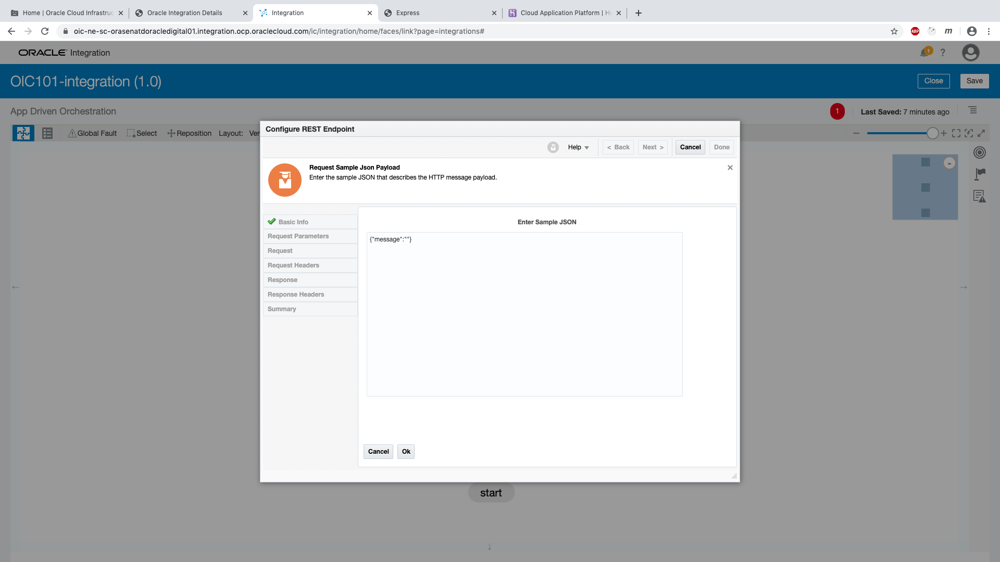

	4. After configuring, you should see a screen similar to this one. Note: you can click the icon pointed out below to automatically center and zoom out to fit all integration components.
	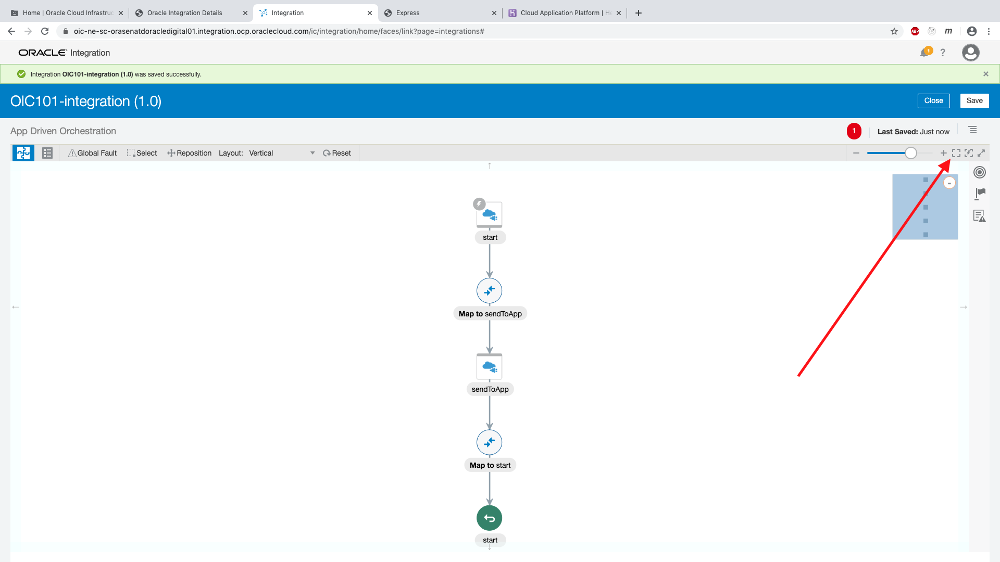
**What's going on here?** This connection was configured originally to contact the base URL, or `https://oic101.herokuapp.com`. When the connection was added to the integration, the relative resource URI was `callOic`. This means that when the integration reaches this component, OIC will make a POST call to `https://oic101.herokuapp.com/callOic`, which is precisely the URL to hit. Also, the payload/body sent along with the POST request was of the form `{ "message": ""}`, which is the format that the application recognizes (a single object called "message" of type string, as indicated by the empty double quotes). Even though the format has been defined, the actual payload has yet to be sent over. You will hard-code this string first, then modify the integration to dynamically accept any string based on a parameter.

6. Configure the map called "Map to sendToApp".

	1. Click on the map and select the pencil icon. For reference, the eyeball icon allows you to view the map, the pencil icon allows you to edit the map, and the menu/details opens a menu with more options.
	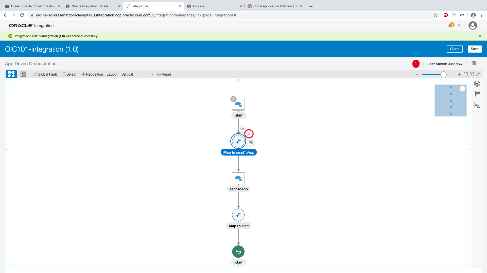

	2. The map dialog opens, detailing all elements prior to this map on the left side and all inputs to the immediate next element on the right side. In this case, the immediate next element is the REST connection to the application, sendToApp, and it was defined to have a payload containing a single "message" object of type string. Click "\*message" (first image), click on the line that says "-- Drag and Drop or Type value here...", and enter a random value (second image), for instance "This is a message from OIC." This message must be different from the default value of the message stored on the application, which is "Hello world!!!". Click **Save** to save the map, then **Close**, and finally **Validate** and then **Close**.
	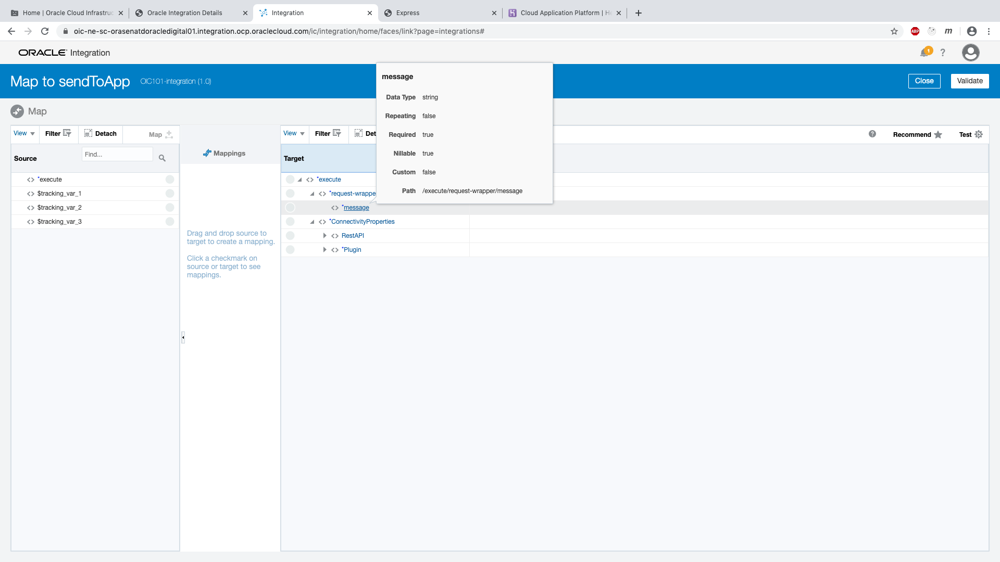
	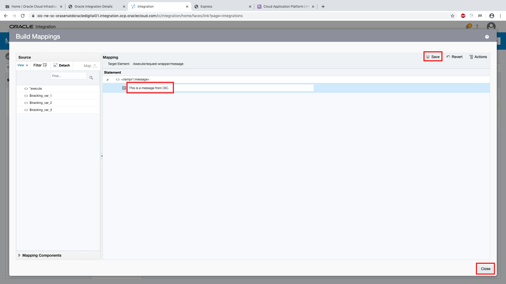

7. All working parts of the integration are now configured properly. Before activation, all integrations must have one of the initial variables enabled for tracking. What this means is that when a user checks all instances of integrations that have been triggered, the user will be able to find the (usually) unique instance he/she is looking for, especially if there are errors in any of the tracked instances. You can see that there is an error, denoted by the red oval with a number 1 in it; this error is exactly the lack of a tracked variable. First, select the most hamburger-looking menu in the upper right corner, then click **Tracking** (first image). This opens a dialog box for tracking variables. **Click and drag** the only variable - `execute` - to the **Tracking Field** column (second image). Then click **Save** to save the tracked variable, and then **Save** and **Close** out of the integration (upper right corner).
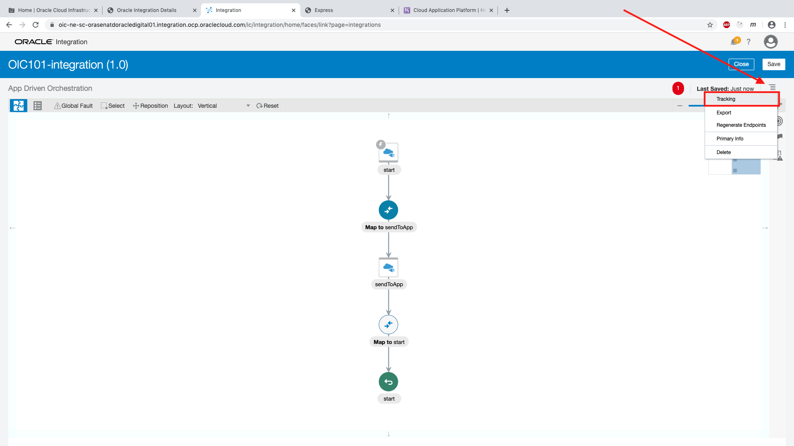
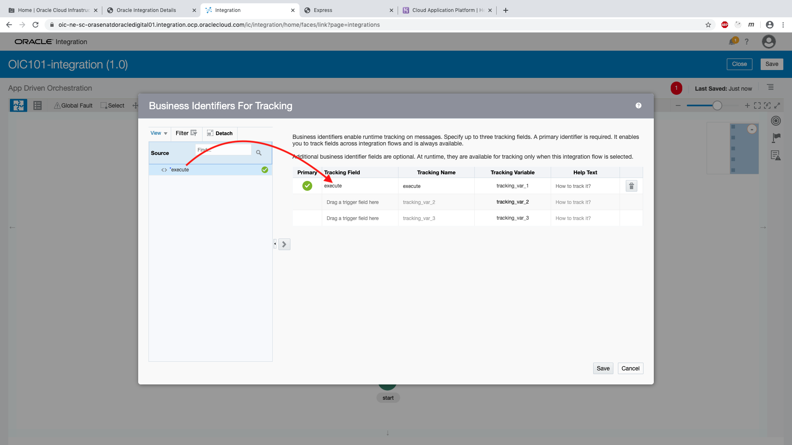

## **STEP 4**: Run and Track the integration

At this point, the integration should be ready for activation. **Return to the Integration dashboard** if you have not already done so. You should see something that looks like this:
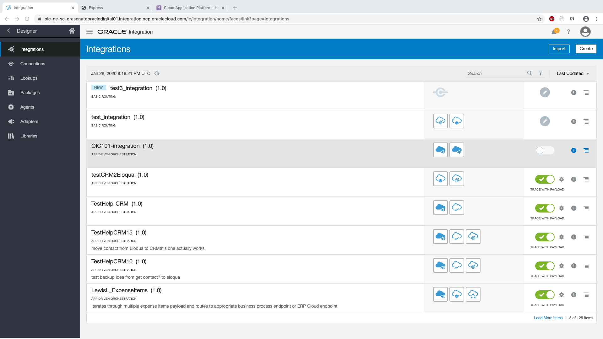
If a **pencil icon** appears in the place of a white switch, the integration is not ready for activation. Please check that you have completed all parts of section 3 before moving on. If a **lock icon** appears in the place of a white switch, this indicates that another session is in progress right now. This can happen if another user is currently editing your integration, or if you were moved out of edit mode by a page refresh or some navigation away from your integration other than clicking **close**. In this case, you must first unlock your integration by clicking the hamburger menu on the right side of the rectangle containing your integration, then select **unlock**. Then you will be able to activate your integration if the white switch appears.

### 4.1: Activate the integration
1. Click the switch icon. This brings you to a dialog box. Uncheck "Contribute integration mappings..." and check "Enable tracing". Once it appears, also check "Include payload". Finally, click **Activate**. You should see a screen that looks like the second image when you have successfully activated the integration.
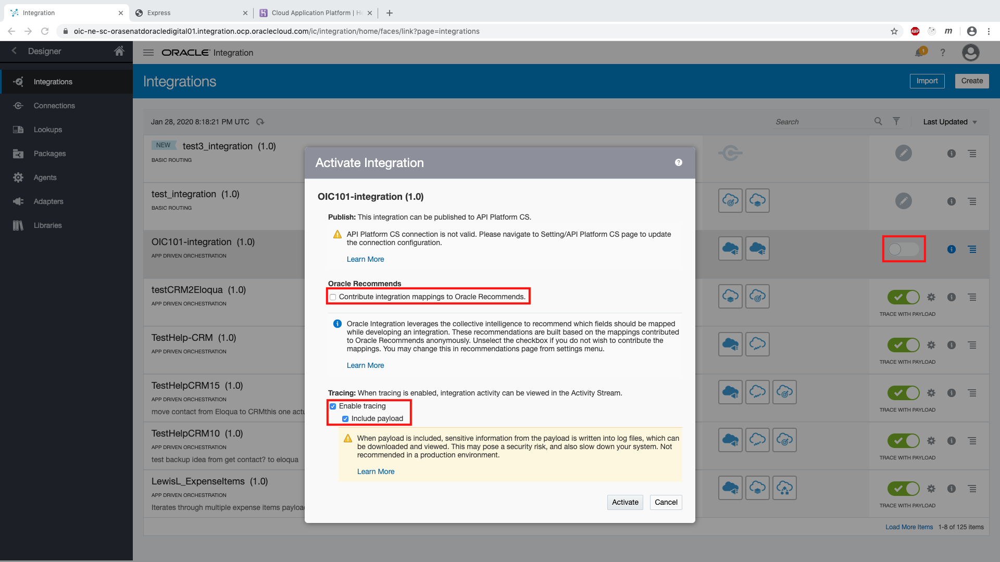
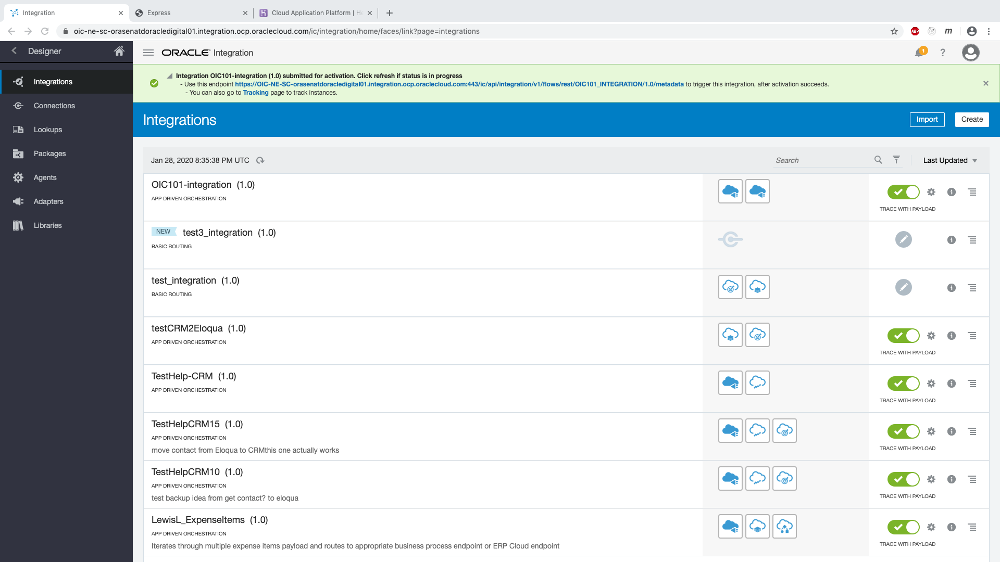

**NOTE**: For development and testing environments, it is ok to include the payload for debugging purposes. However, to be best-practice complaint, you should not include the payload for production environments. Also, this payload will appear in the **activity stream** or **activity log** (see [Activity Log](#activity) under Miscellaneous important information within OIC).

2. At the very top, a green banner with two links should appear. Navigate to the website that looks something like `https://oic-ne-sc-orasenatdoracledigital01.integration.ocp.oraclecloud.com/ic/api/integration/v1/flows/rest/OIC101_INTEGRATION/1.0/metadata`. You can do this by clicking the corresponding link in the green banner, or you can click a new **gear icon** that gives you equivalent links (first image). Both of these take you to the metadata page (second image).
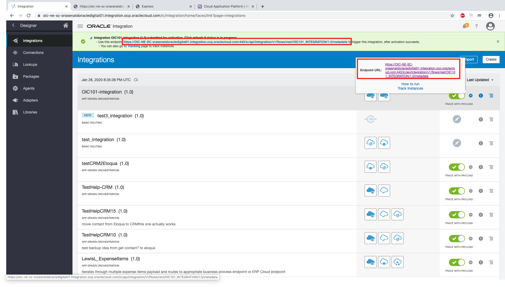
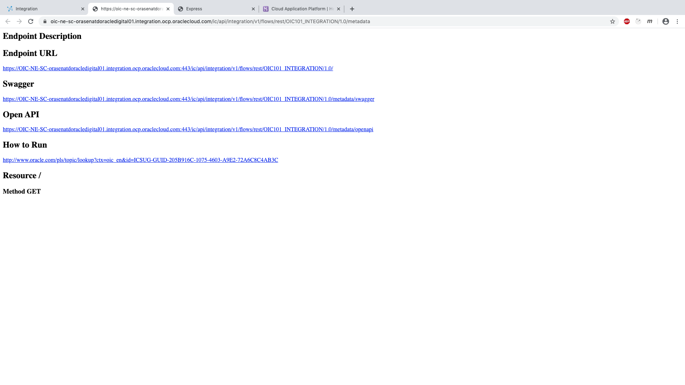

3. The above page is exactly the page spawned by using the Sample REST Endpoint Interface. Notice that the first URL is the Endpoint URL; this is the only one that is important to running the integration as of now. Clicking that link will **trigger** the integration to run, as the trigger of the integration was defined to look for a GET request at the `/` resource (nothing additional after the initial URL). **Click the first link**; you may need to enter your credentials for Oracle Cloud again.

4. After a while, the page shows up as blank. This is a good sign; this indicates that the application has run without errors. Usually, any errors (e.g. 404, 500, 401) will print an eponymous message here if they were encountered during runtime. Navigate to https://oic101.herokuapp.com/responseFromOIC to see that the string you assigned in the mapping has indeed appeared as the message to this application. You have successfully built and run your first working integration using Oracle Integration Cloud!
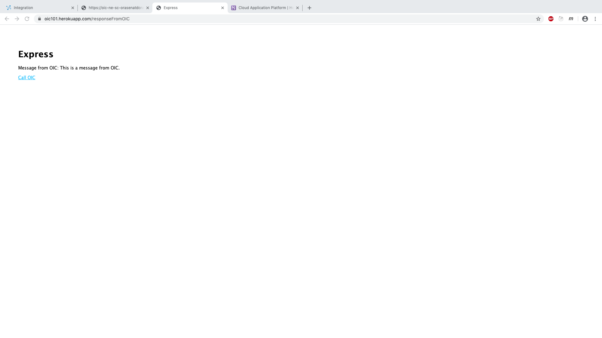

### 4.2: Track instances and view the application
Now that the integration has run at least once, you can view the integration's progress in the **tracking** page.
1. Navigate back to the integration dashboard. In the upper-left corner, select the **hamburger menu** to open the left sidebar menu, then click the **left chevron** next to "Designer" (first image). Click **Monitoring**, then **Tracking** (second image).
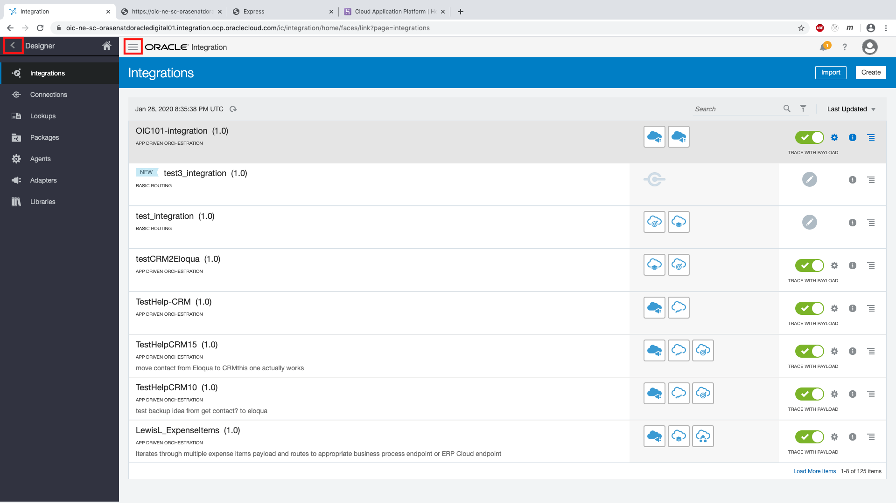
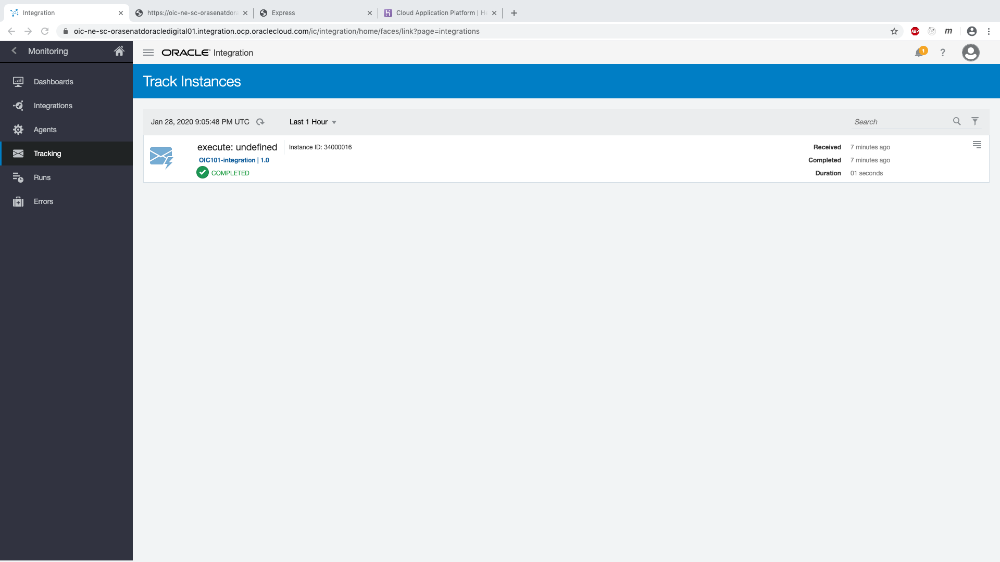

**NOTE**: You should see a successful instance relating to the most recent run of the integration, noted by a green check mark next to "completed" (as in the above image). If there was an error, you should see instead a red X next to "failed". Currently you are only viewing instances that were run from an hour ago; you can request as much as three days ago or a custom range. Also, if you suspect that another instance was run after you last loaded this page, you can click the refresh icon next to the UTC time stamp: NOT the refresh button for the whole page.

2. Here, you can drill down into the instances that were most recently run. **Click** on "execute: undefined" to drill down into the instance. You should see a copy of the integration that shows the flow of the current selected instance of when the integration was triggered, outlined in green.
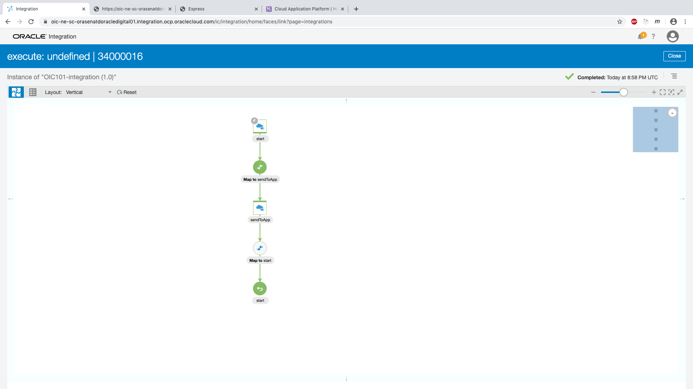

**NOTE**: In the unlikely event that your instance is marked as failed, you can still drill down to see which component of the integration failed (marked as red). You can then select that component and click on the error symbol (a triangle with an exclamation point) to view the error that caused the integration to break.


## **STEP 5**: Modify the integration

In **STEP 3**, part 6, you configured a map to send a hard-coded string to the Heroku application. In this step, you will change your integration to instead send a string based on a parameter.

### 5.1: Modify the integration
Once again, don't forget to save every now and then.
1. First, deactivate your integration. You can do this by either clicking the hamburger menu on the right side of the rectangle containing your integration, then "Deactivate", or by clicking the switch (now green and with a check mark). Once you see a green banner at the top and that the switch has turned "off" (is now white), you will have deactivated your integration.
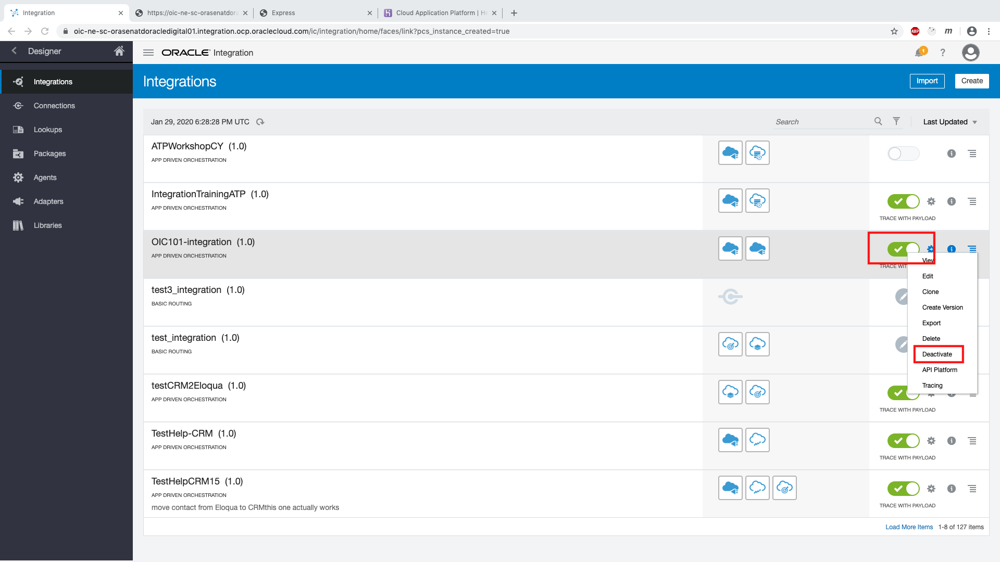

2. Click on the integration to navigate into the integration, and select the first component, or the trigger to edit.
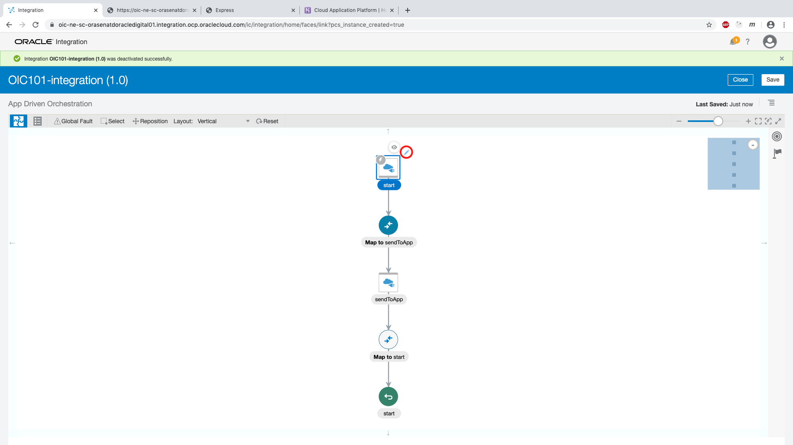

3. On the left menu, select **Basic Info**, then select the check box for **Add and review parameters for this endpoint**. Then click **Next**.
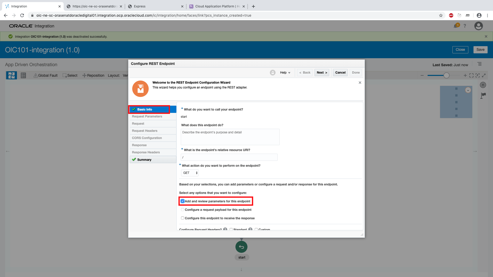

4. Instead of taking you directly to the summary, the dialog box instead enables you to configure a parameter now. Click the + to add a parameter. Call the parameter `qmessage`, and set its data type to be "string".
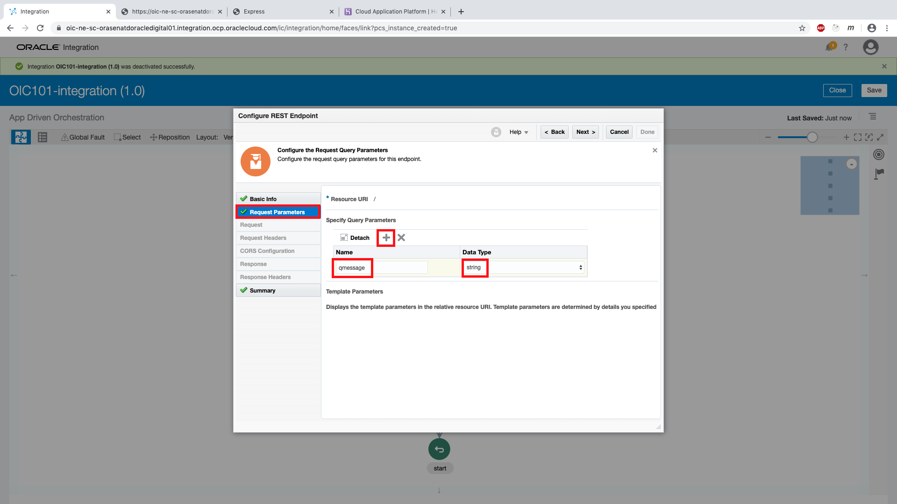

5. Click **Next** and **Done**. A dialog box will pop up informing you that a change to this component will affect a map that depends on this component: select **Update**. The map in question is the map right after the trigger component. Select the **Map to sendToApp** to edit.
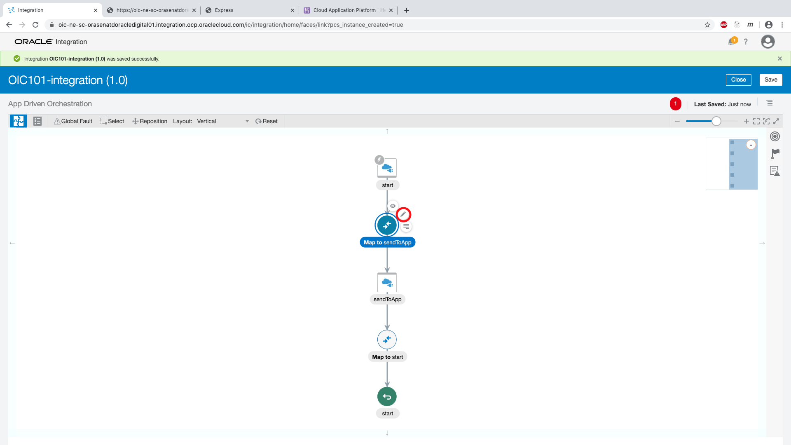

**NOTE**: You will also notice that upon updating the trigger, the old variable you were tracking `execute` now contains a new object called `QueryParameters`. OIC cannot track variables that are not leaf nodes, i.e. have no children variables. You can confirm this by looking at which variable has a "dropdown menu" (not a leaf node) and which variables do not (is a leaf node). You will have to re-track a variable.

6. Right click the **\*message** row on the right and select **Delete Mapping** (first image). Once you are done, drag the `qmessage` variable from the left side to the `*message` variable on the right side (second image). Finally, click **Validate** and then **Close** in the upper right corner.
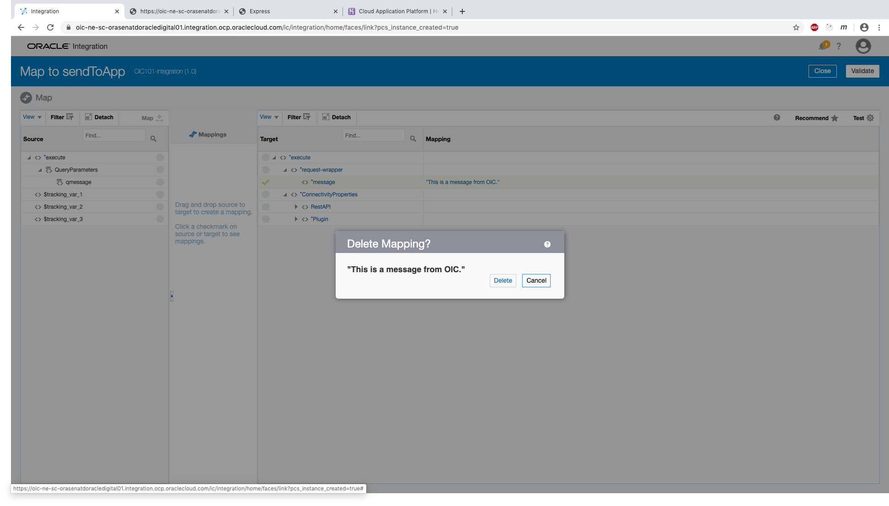
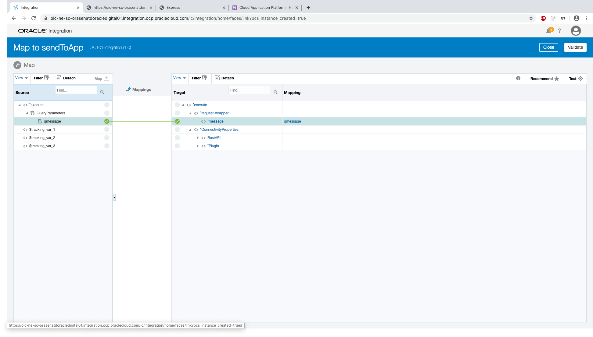

7. Finally, you will have to track a variable. First, enter the tracking dialog box (consult part 7 of **STEP 3** for more information). Then drag the **qmessage** field onto the tracking field. The result should look something like below. Click **Save**. Then **Save** and **Close** out of your integration.
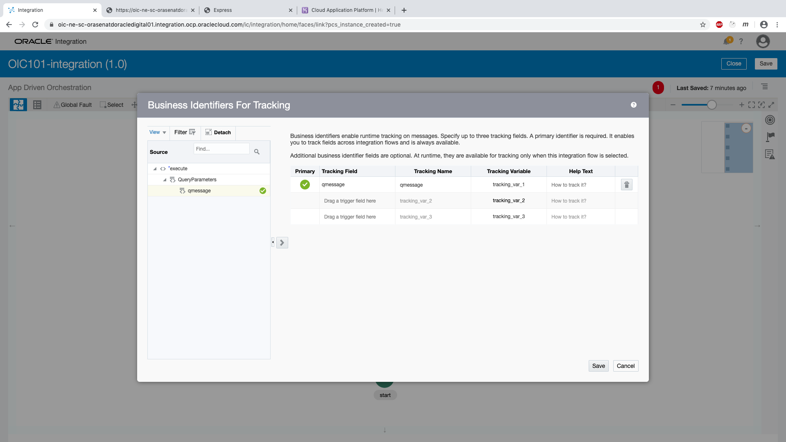

**NOTE**: Now that you are tracking a variable with meaningful content, you will notice that in the tracking menu each tracked instance will be somewhat unique as opposed to the `execute: undefined` generic tracked variable.

### 5.2: Run and Track the integration
1. Click the white switch to activate your integration. Once again, deselect **Contribute integration mappings...**, and select **Enable tracing** and **Include payload**.
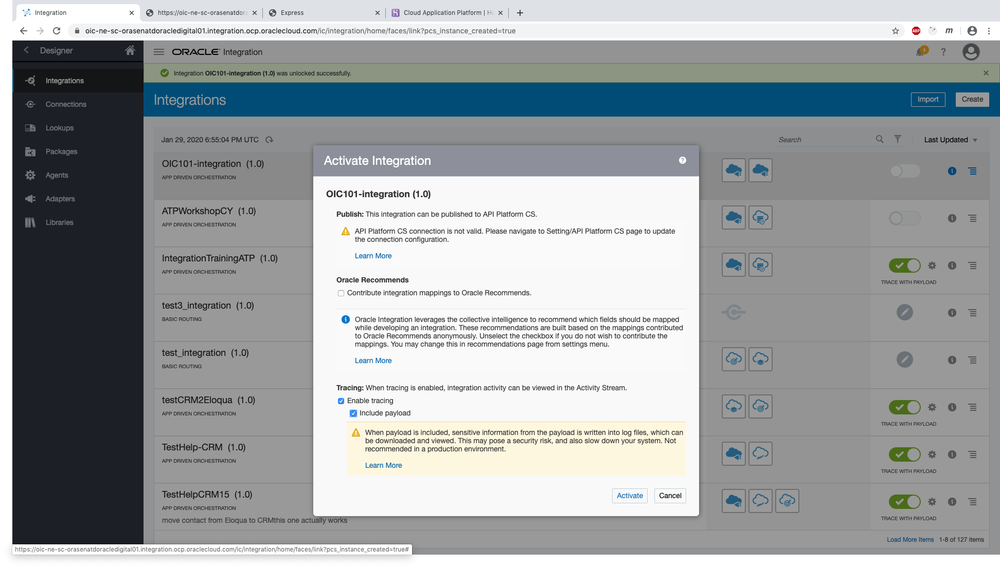

2. This time, **Copy** the endpoint string. You will need to add a parameter to the URL. In my case, the endpoint string is:
```
https://OIC-NE-SC-orasenatdoracledigital01.integration.ocp.oraclecloud.com:443/ic/api/integration/v1/flows/rest/OIC101_INTEGRATION/1.0/
```
To add a message, append the string `qmessage=Hello again` at the end of the URL, replacing `Hello again` with whatever string you wish. Quotes are optional; any "special characters" such as spaces are replaced in the browser by a code represented by that character's hexadecimal value. Here are examples of the same valid GET URL:
```
https://OIC-NE-SC-orasenatdoracledigital01.integration.ocp.oraclecloud.com:443/ic/api/integration/v1/flows/rest/OIC101_INTEGRATION/1.0?qmessage=Hello again
https://OIC-NE-SC-orasenatdoracledigital01.integration.ocp.oraclecloud.com:443/ic/api/integration/v1/flows/rest/OIC101_INTEGRATION/1.0?qmessage=Hello%20again
```
Note that the last slash after "1.0" is optional. Once you have built your URL, enter the URL into a web browser to make the GET request. Remember to navigate to https://oic101.herokuapp.com/responseFromOIC to view the latest string sent over!

3. Navigate to the Tracking screen (see section 4.2 of **STEP 4**). Here I have tested a series of strings in the parameter, using the following URLs:

| URL                              | Message from OIC | Comments                 |
|----------------------------------|------------------|--------------------------|
| `.../1.0/`                       |                  | No string was sent over. |
| `.../1.0/?qmessage="Hey!"`       | `"Hey!"`         |                          |
| `.../1.0/?qmessage=Hello again`  | `Hello again`    |                          |
| `.../1.0?qmessage=Hi%20again`    | `Hi again`       |                          |
| `.../1.0?qmessage=%97%98`        | `��`	          | Apparently %97 and %98 point to undefined encodings or unrecognized special characters. 97 and 98 are the decimal representations of 'a' and 'b', but in hexadecimal they are the characters 151 and 152, which should be 'ù' and 'ÿ'. |
| `.../1.0?qmessage=Hello%20again` | `Hello again`    |                          |

This concludes the workshop. You may keep the integration and connection if you wish. To download the source code for the Heroku application, please visit this link: https://github.com/OracleMichael/OIC101/blob/master/oic101.tar. You may then opt to deploy this code to your own Heroku app to further modify this application. Creating and maintaining a Heroku account is free, as long as no "add-ons" (e.g. Dynos, Metrics) are configured and you are the owner of no more than 5 applications.

<!--
## Where to go from here

Let's review what you've learned.
- In the beginning, you started with a Heroku application that requires some input, abstracted by a single string variable called `message`. In the real world, the Heroku app / `message` model represents _multiple_ business applications each requiring a specific CRUD operation (Create, Read, Update, Delete). This implies that the integration you've built - consisting of a single trigger and a single invoke - may need to perform many invokes for a business application. The integration may even need to perform some logic on its own instead of linearly invoking its many connections: this was never touched on in this workshop.
- You built an integration that communicated with the Heroku app. This required the following:
	- You created a REST connection that can call the various exposed endpoints built into the Heroku app. Usually, most business applications have far more than two exposed endpoints. In fact, some businesses will require specific authentication or configuration in order for OIC to be able to communicate with them, adding on layers of security and indicating that there are far more ways for OIC to connect with all the applications out there. REST just happens to be one of the most often used ways to invoke APIs, along with SOAP and maybe FTP.
	- You needed to understand the exposed endpoints available on the Heroku application to build the connection. Many business applications will have richer documentation on their endpoints than what is provided at the beginning of **STEP 2**.
- In the end, you built an integration layer on top of the initial Heroku app. The integration layer performs all of the automation necessary to invoke other key parts of some business in progress, simulated by the lone Heroku app. Meanwhile, **some application can call the integration**, triggering all of the business logic in OIC. So if you have a second application, which you could also deploy on Heroku, you can have that application call the integration, sending some information recognized by the integration (this would be in the form of a parameter in the GET), to trigger the rest of it.

Overall, you learned the **basics of navigating OIC**, how to **build integrations** on OIC, and how to **view runtime issues**.
-->
Here are a few links to other workshops/guides on OIC that teach you how to build more complex integrations:
[Connecting Autonomous Transaction Processing (ATP) with OIC](https://github.com/OracleCPS/ATPworkshop)
[Integrating OIC with SaaS applications](https://github.com/OracleCPS/oicsaasintegration) (start with lab 200 or 300)


## Miscellaneous important information within OIC
<div id="misc"/>

TODO: All parts beyond this point are optional. This information will slowly be filled in later.

### Integration components

### Activity Log
<div id="activity"/>

### Variable Tracking

### Designer menu vs Monitoring menu

